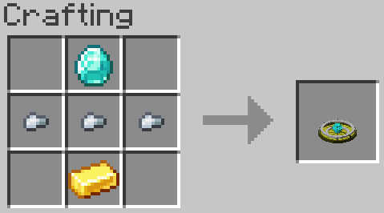
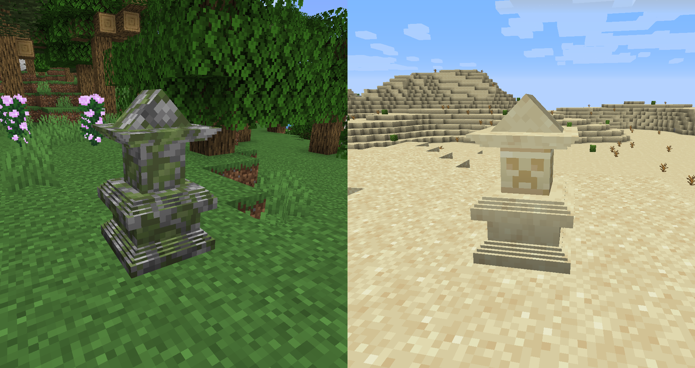

# Esther
As you level up, you gain not just experience, but mana

This mana, displayed next to your level bar, can be used to cast a number of spells, and replenishes over time or upon sleeping.
These spells range in power from trivial to devastating and are cast by typing their respective incantations in chat and holding any item components in your hand.
The spells currently implemented are below.

These spells are **fire and forget**. You cast them and they immediately do something.
* *ignus* - Light a fire where you're pointing, similar to Flint and Steel. Works on entities. Costs 1 mana.
* *crepitus* - Shoots a fireball towards your cursor whose power scales with your player level. Costs 5 mana.

The following spells are **aura** spells. They last until you deactivate them, and while active, they reserve their mana cost and you cannot regain it.
* *celeritas* - Grants Haste 1. Costs 10 mana and 3 sugar.
* *citius* - Grants Haste 2. Costs 20 mana and a honey bottle.
* *summa celeritate* - Grants Haste 3. Costs 30 mana and 5 feathers.
* *se tardum* - Deactivates any of the Haste aura.

* *respirare me aquae* - Grants Waterbreathing. Costs 10 mana and a Tropical Fish Bucket. Is deactivated with *respirare me aere*
* *igni mihi caelum* - Grants flight. Costs 35 mana and 12 blaze rods, which are returned upon deactivation. Is deactivated with *descendit*

There are two more spells. To use them, use must craft an Ascendant:

Next, you must find one of these two shrines. They generate rarely in Forest and Desert biomes, respectively.

* *sanguinem filio, sanguinem effurgarex perpetuum* - Binds the Ascendant to the area surrounding the shrine, creating a pocket world that's a copy of that area. Costs 30 mana.
* *sangima maerma, bernos asescenda* - Teleports you to the pocket world inside of the Ascendant. While here, you cannot die. Costs 15 mana.